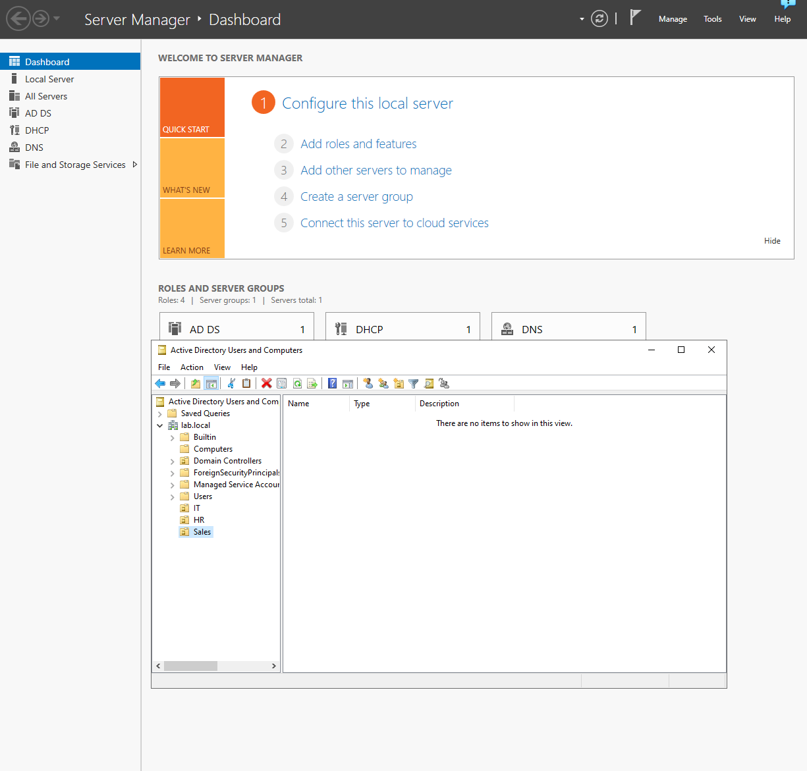
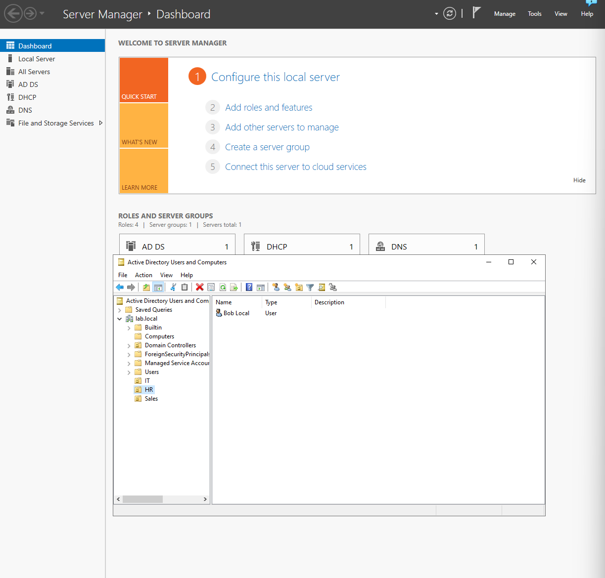
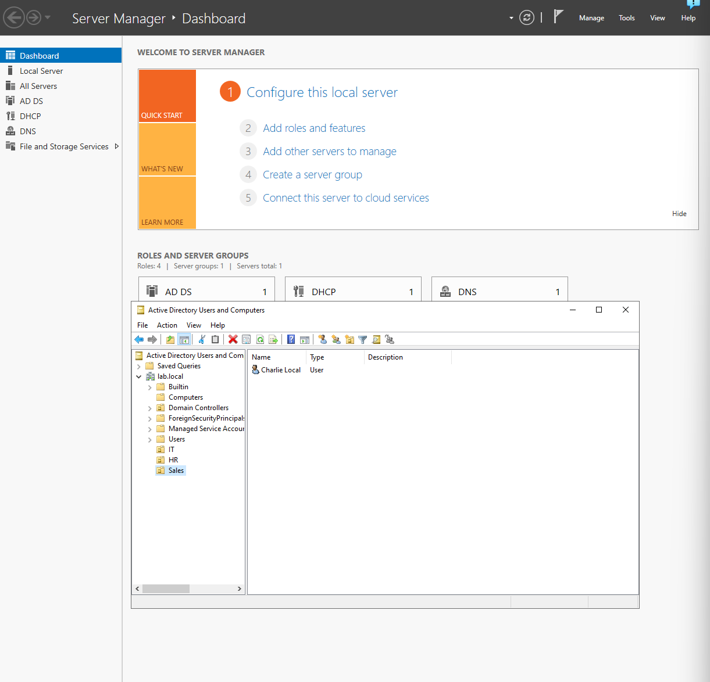
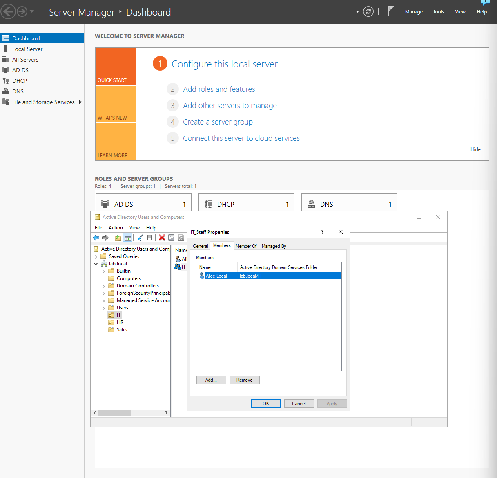
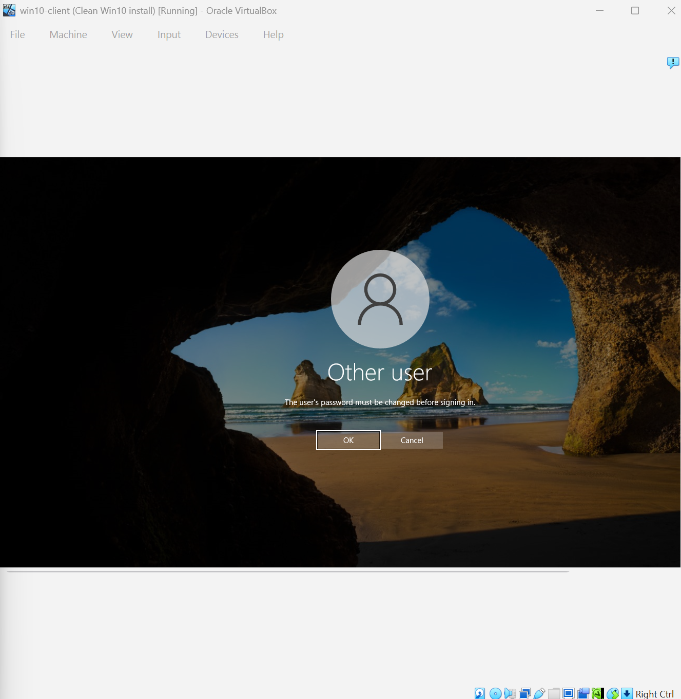
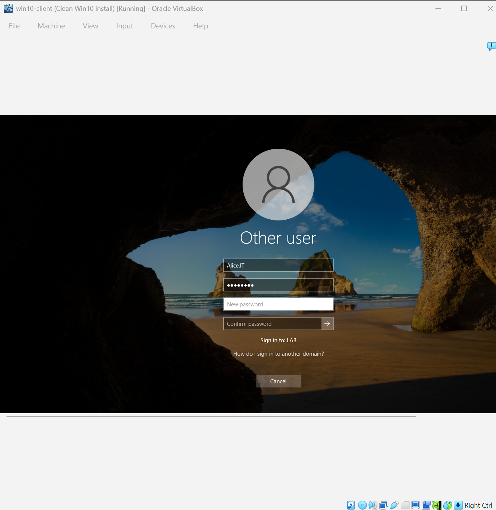
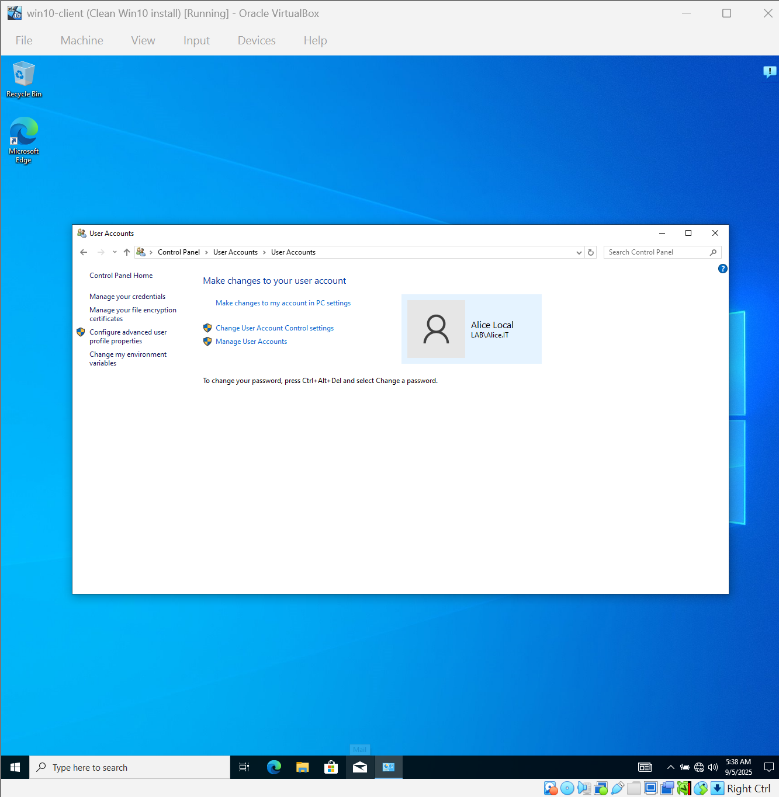

# Lab 01 – Active Directory Basics

**Goal:**
To create organizational units, users, and security groups. Test password change and logging in to domain accounts.

---

**Environment:**

* Windows 10 Pro (Oracle VirtualBox)
- Roles: AD DS, DNS, DHCP
* Windows Server 2022 (Oracle VirtualBox)
- Joined to Server 2022 domain.

---

**Steps to Reproduce:**

1. Created Organizational Units (IT, HR, Sales)
2. Created Users and placed them in the appropriate OU.
3. Created Security Groups (IT_Staff, HR_Staff, Sales_Staff)
4. Added Users to their corresponding Groups.
5. Reset a user password and enforce "must change at next Login. "

**Result:**

- Users successfully logged in to the domain.
- Password reset forced the user to choose a new password at first login.
- Group membership reflected correctly in Active Directory.

---

**What I Learned:**

- How OUs structure Active Directory for easier management.
- How to create users and groups and assign them logically.
- How password reset works in practice from both admin and user perspectives.

---

**Screenshots:**

