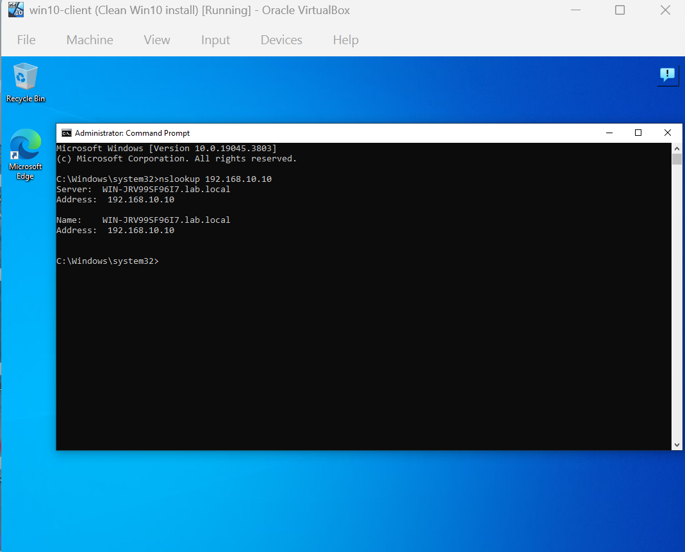
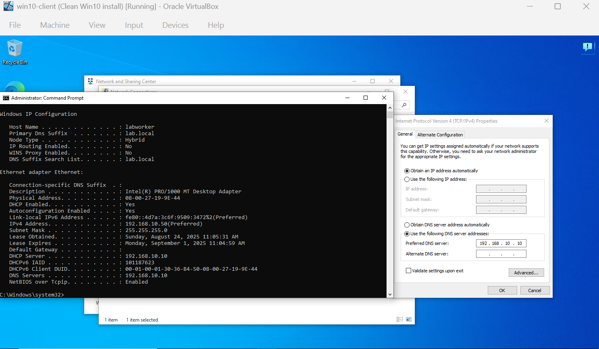
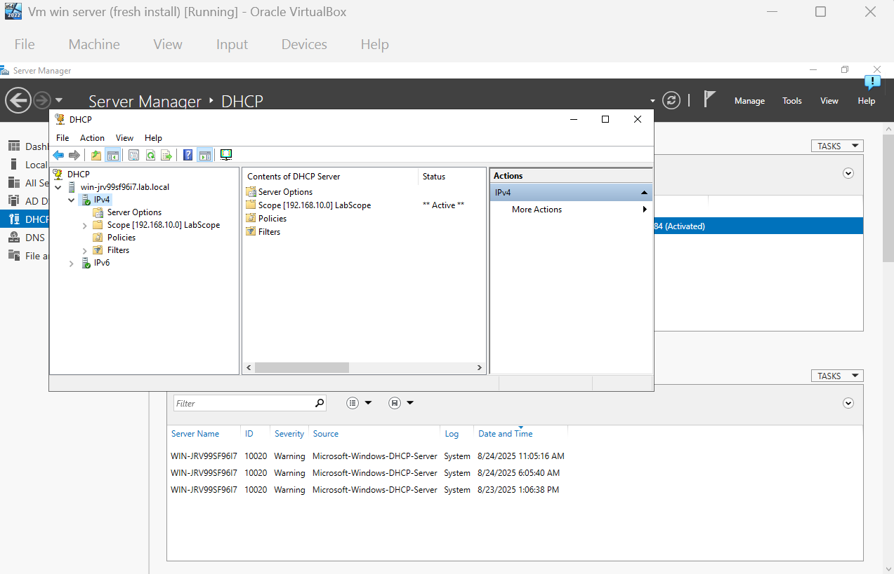

# Lab 02 – DHCP + DNS

** Goal:**
Configure a Windows Server VM to provide IP addresses via DHCP to a Windows 10 Pro client VM, with DNS resolution for the lab domain.

---

** Environment:**

* Windows 10 Pro (Oracle VirtualBox)
* Windows Server 2022 (Oracle VirtualBox)

---

** Steps to Reproduce:**

1. Set up a Windows Server 2022 VM.
2. Assign a static IP (chosen: `192.168.10.10`).
3. Install **AD DS**, **DNS**, and **DHCP** roles.
4. Configure and activate a DHCP scope.
5. Set both VMs to use the **Internal Network** in VirtualBox.
6. (For this lab) Disable **IPv6** on the server’s NIC.
7. Set up the Windows 10 Pro client VM.
8. Assign a static IP (`192.168.10.20`) and DNS (`192.168.10.10`).
9. Join the client to the domain (`lab.local`).
10. Switch the client back from static IP to automatic (DHCP).

---

** Troubleshooting Observations:**

* `ipconfig /all` on client → showed `169.254.x.x` (APIPA address).
* `nslookup 192.168.10.10` → request timed out.
* `nslookup lab.local` → request timed out.
* `ipconfig /all` on server → showed DNS as `::1` (IPv6 loopback).

---

** Fix Implemented:**

* Gave the client a static IP before domain join.
* Disabled IPv6 on the server’s NIC to avoid DNS resolving to `::1`.
* Activated the DHCP scope in DHCP Manager.

---

** Result:**

* Client successfully receives IP from DHCP.
* Client can ping the server and resolve `lab.local` via DNS.

---

** What I Learned:**

* Always assign a **static IP** to the server before configuring AD DS and joining clients.
* Watch out for **IPv6 (::1)** interfering with DNS resolution in small labs — disable it if not needed.

---

** Screenshots:**

