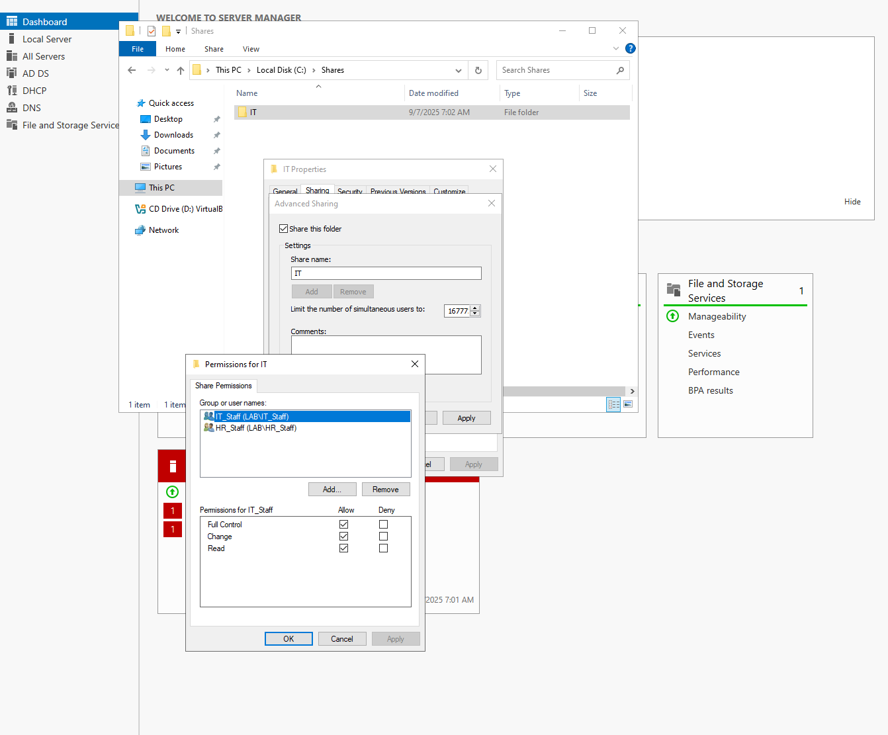
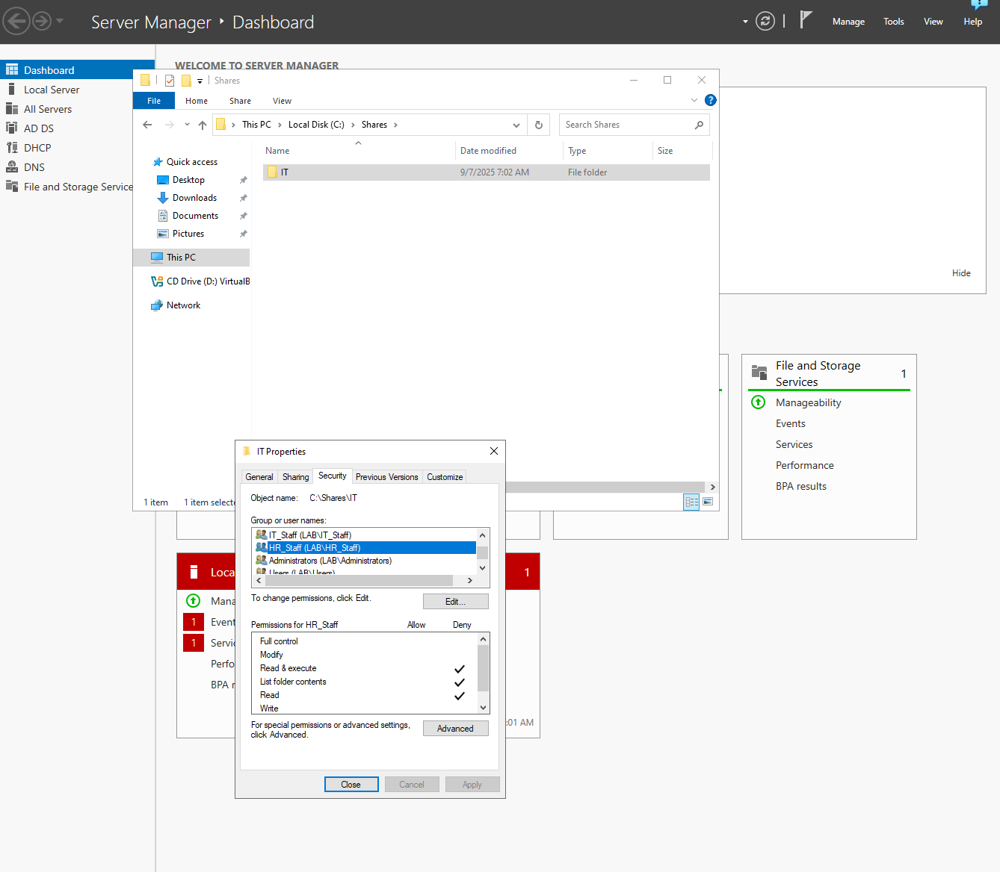
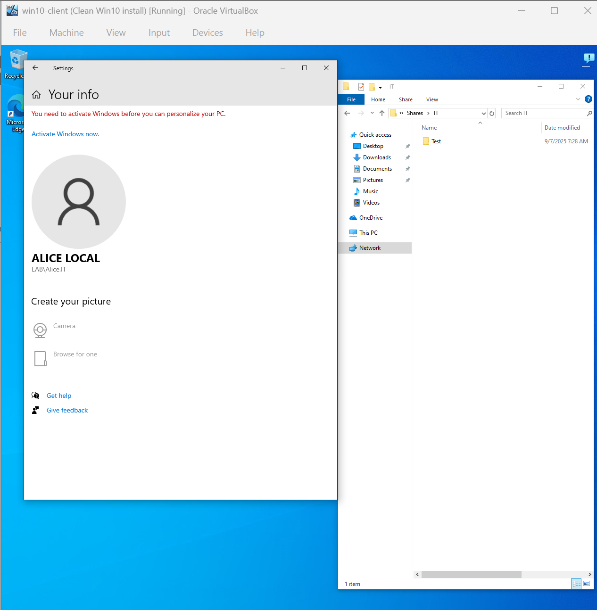
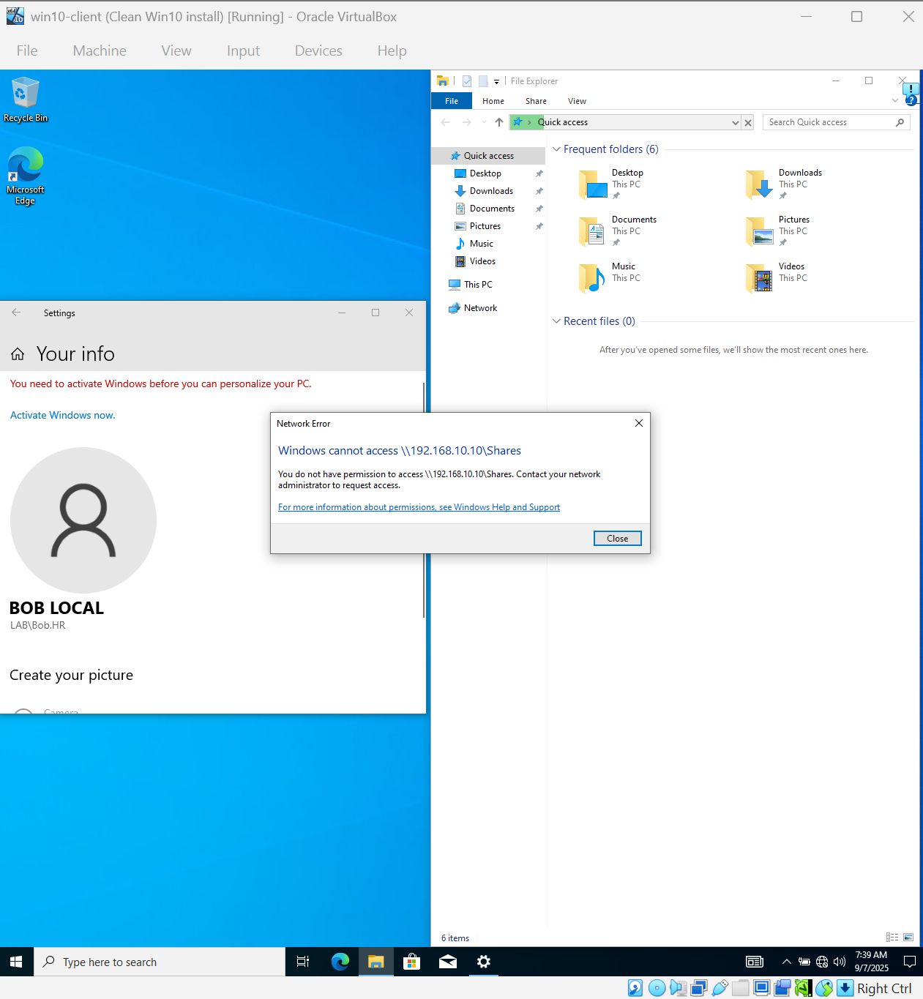
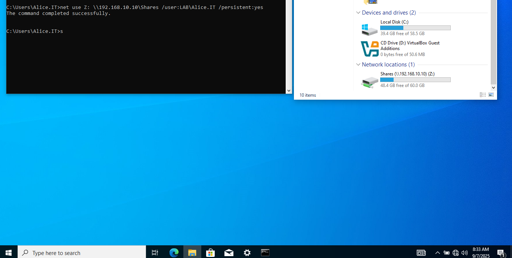
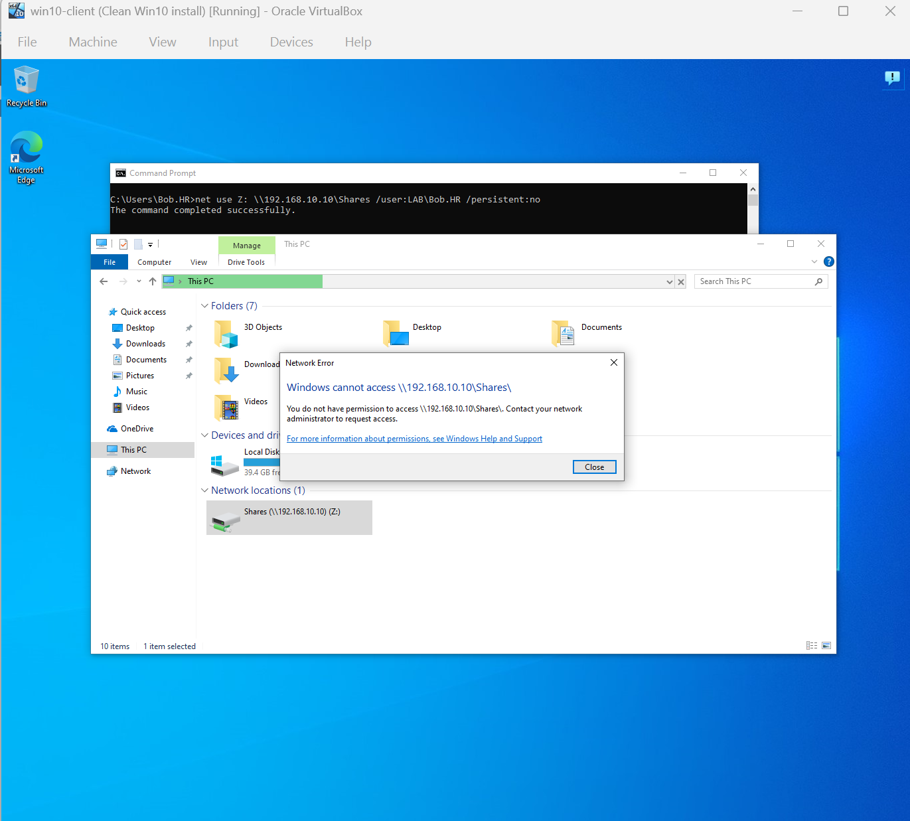

# Lab 03 – File Share + NTFS Permissions

**Goal:**
Set up a shared folder so IT staff can access it, but HR cannot.

---

**Environment:**

* Windows 10 Pro (Oracle VirtualBox)
- Roles: AD DS, DNS, DHCP, OUs
* Windows Server 2022 (Oracle VirtualBox)
- Joined to Server 2022 domain.

---

**Steps to Reproduce:**

1. Created the Shared Folder (Full control permissions for IT, denied permissions for HR)
2. Configured NTFS Permissions (Modify control permissions for IT, denied permissions for HR)
3. Opened the shared folder with the IT user, got denied with the HR user.
4. Used Net Use to map the shared folder for both IT and HR.

**Result:**

- IT users can access the shared folder while HR can't.

---

**What I Learned:**

- How shared folders and permissions behave.
- Whole process from shared folder creation to permissions.
- Using the net use CLI command.

---

**Screenshots:**

