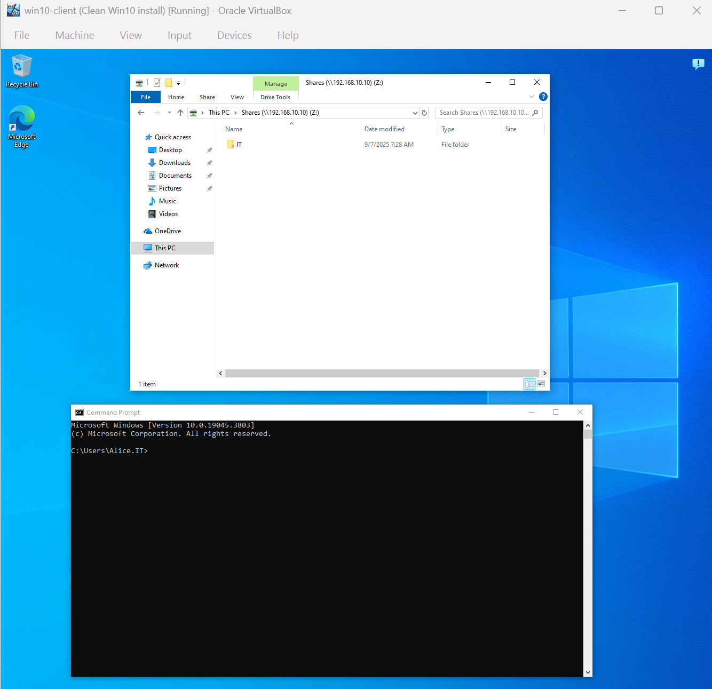

# Lab 03 – File Share + NTFS Permissions

**Goal:**
Set up a shared folder so IT staff can access it, but HR cannot.

---

**Environment:**

* Windows 10 Pro (Oracle VirtualBox)
- Joined to Lab.local domain
- Test clients: Alice (IT), Bob (HR)
* Windows Server 2022 (Oracle VirtualBox)
- Roles: AD DS, DNS, DHCP
- Domain Controller for LAB.local

---

**Steps to Reproduce:**

1. Created the Shared Folder (Share permissions: IT = full control, HR = Deny).
2. Configured NTFS Permissions (Share permissions: IT = Modify, HR = Deny).
3. Tested access: Alice (IT) success, Bob (HR) denied.
4. Used `net use` to map the share from both users.

**Result:**

- IT (Alice) = Access success
- HR (Bob) = Access denied
- IT users can access the shared folder while HR can't.

---

**What I Learned:**

- Difference between Share vs NTFS permissions
- How to test permissions using multiple domain users
- Mapping drives via command line (`net use`)
- Validating access control in a real-world scenario

---

**Screenshots:**

