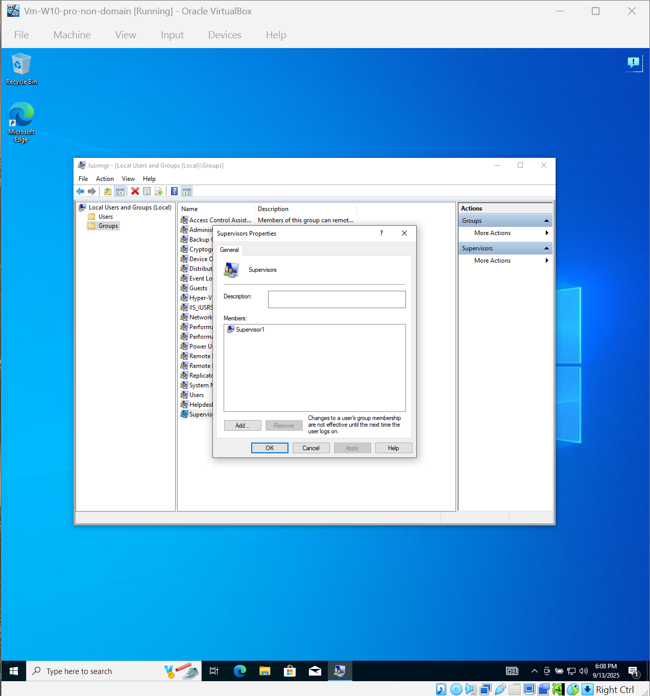

# Lab 04 – Local User + Group Management Lab

**Goal:**
Practice creating and managing local users, groups, and security policies on a standalone Windows 10 Pro machine.

---

**Environment:**

* Windows 10 Pro (Oracle VirtualBox)

---

**Steps to Reproduce:**

1.
- Created local users: `Helpdesk1`, `Tech1`, and `Supervisor1`.

2. 
- Created `Helpdesk` group and added `Helpdesk1` + `Tech1`. 
- Created `Supervisors` group and added `Supervisors1`.
- Added `Supervisor1` to the built-in `Administrators` group.

3. 
- Set **Minimum password length** to 8 characters.
- Set **Maximum password age** to 30 days.
- Enabled **Account lockout** after 3 invalid login attempts.
- Set **Lockout duration** to 30 minutes.

4. 
- Entered incorrect password 3 times for `Heldpesk1` > Account locked.
- Logged in with `Supervisor1` and verified Administrator rights.

**Result:**

- Three local user accounts created.
- Users organized into appropriate groups.
- `Helpdesk1` account locked after failed attempts.
- `Supervisor1` confirmed to have Administrator privileges.

---

**What I Learned:**

- How to create and manage local user accounts.
- How to configure local group memberships.
- How to apply and test password and lockout policies.
- How to verify administrative privileges.

---

**Screenshots:**

