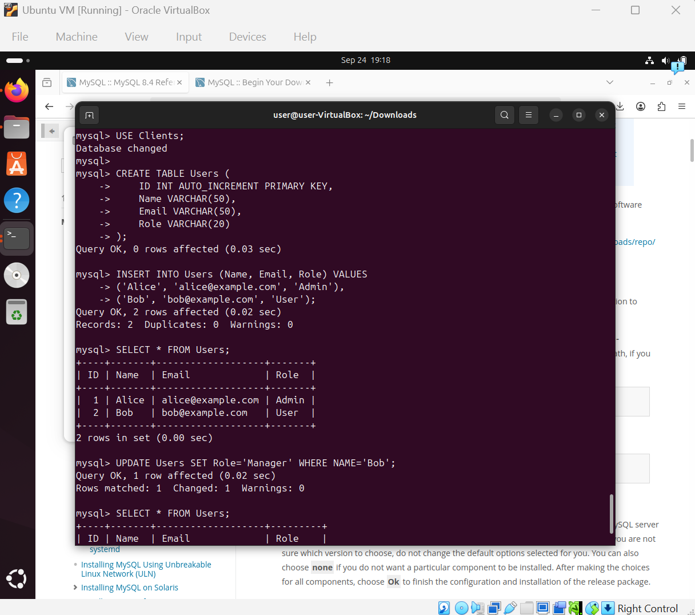
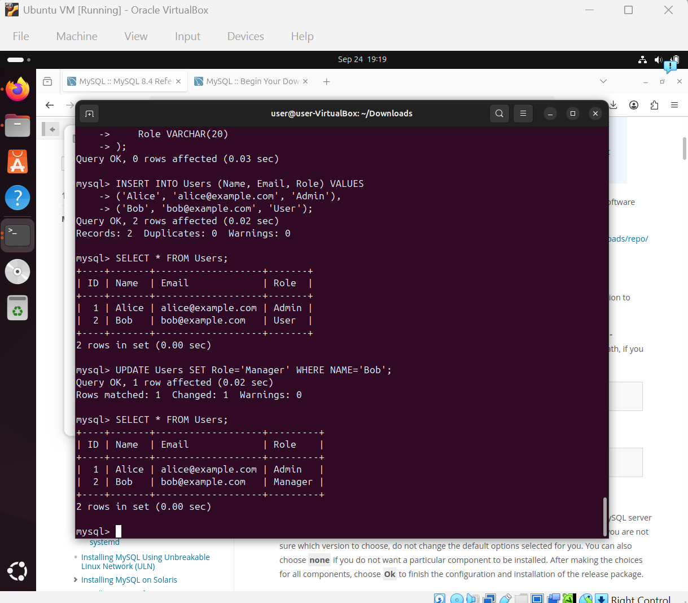

# Lab 05 – SQL Mini-Lab

**Goal:**  
Install MySQL on Ubuntu Linux and perform basic CRUD operations (create, read, update, delete) on a sample table.

---

**Environment:**
- Ubuntu 24.04.3 LTS (running in Oracle VirtualBox)

---

**Steps to Reproduce:**

1. Installed MySQL in Ubuntu Linux using the official [MySQL APT Repository documentation](https://dev.mysql.com/doc/refman/8.4/en/linux-installation-apt-repo.html).

   ```bash
   sudo dpkg -i mysql-apt-config_0.8.34-1_all.deb
   sudo apt update
   sudo apt-get install mysql-server

2. Logged into MySQL as root:

   ```bash
   sudo mysql -u root -p
   ```

3. Created a database and table:

   ```sql
   CREATE DATABASE Clients;
   USE Clients;

   CREATE TABLE Users (
       ID INT AUTO_INCREMENT PRIMARY KEY,
       Name VARCHAR(50),
       Email VARCHAR(50),
       Role VARCHAR(20)
   );
   ```

4. Inserted records:

   ```sql
   INSERT INTO Users (Name, Email, Role) VALUES
   ('Alice', 'alice@example.com', 'Admin'),
   ('Bob', 'bob@example.com', 'User');
   ```

5. Updated a record:

   ```sql
   UPDATE Users SET Role='Manager' WHERE Name='Bob';
   ```

6. Verified with:

   ```sql
   SELECT * FROM Users;
   ```

---

**Result:**

* MySQL successfully installed in Ubuntu Linux.
* Created `Clients` database with `Users` table.
* Inserted and updated records successfully.

---

**What I Learned:**

* How to install MySQL on Ubuntu using the apt repository.
* How to create and manage databases/tables.
* Basics of CRUD operations in SQL.
* Difference between logging in as `root` vs. creating a dedicated database user.

---

**Screenshots:**



---
